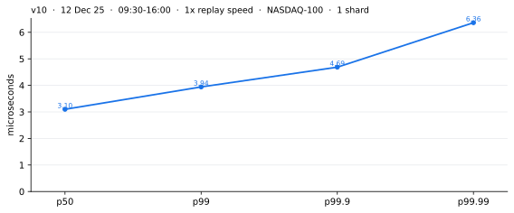
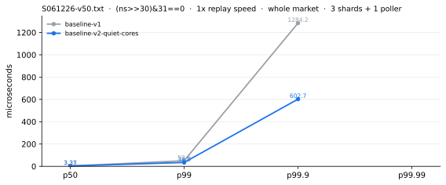
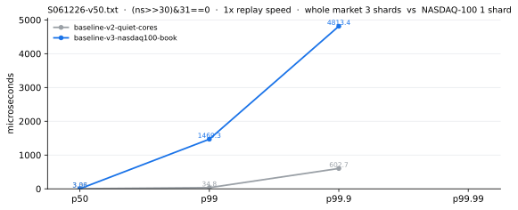
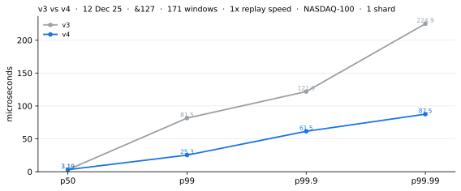
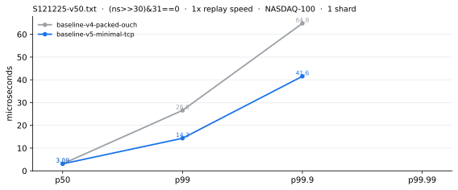
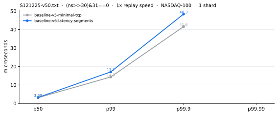
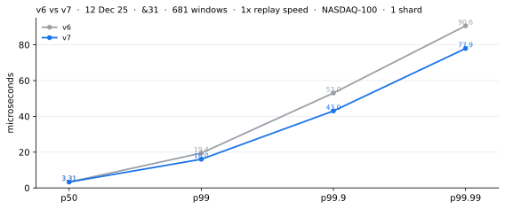
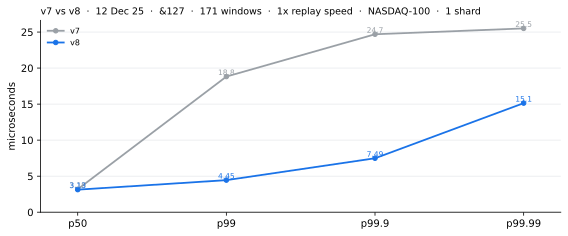
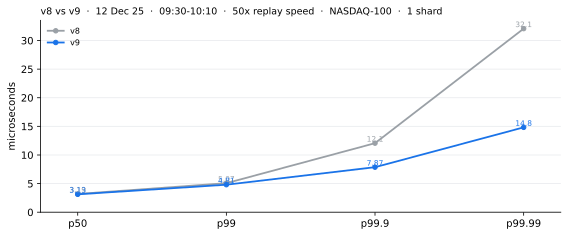
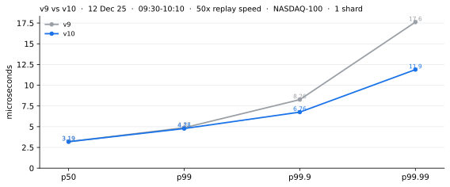

# Wire-to-wire on this machine

Every chart below is wire-to-wire nanoseconds: the card stamping the first byte of a
market data frame arriving, to the card stamping the first byte of the order it caused
leaving. The y axis is linear in every one of them and starts at zero, so the tail is not
flattened by a log scale. All of it is one Solarflare SFN8522 on an AMD EPYC 7K62,
replaying real Nasdaq ITCH.

## Where it stands now



Nothing skipped: six and a half hours of wall clock, 912 million messages, 3,893,353
orders, 3.89 million latency samples and not one of them dropped.

## What each version bought

Each technique gets a branch of its own and is measured against the version before it,
run in the same sitting. Ten baselines so far. Every chart carries the parameters of the
round in its title: which day, how many windows out of the day, the replay speed, which
names have books, and how many shards. Where a percentile is missing from a line, that
round did not record it.



Nothing in the gateway changed. The reserved cores were not actually reserved: an ssh
tunnel woke on one of them every ninety seconds, and reading a UEFI variable stalls every
core on both sockets for 1.13 ms.



The whole feed is still taken in, but books are kept only for the Nasdaq-100, and one
core now does everything instead of one poller feeding three shards. The tail looks like a
disaster and is not one: the number of samples fell 4.6x with the shorter list, so the same
few thousand slow samples now sit at a much higher percentile. Counted as orders rather
than percentiles, 1,537-4,480 of them passed a millisecond before and 4,686 after.



Telling the stack what went out costs 810 ns and is paid once per message, not once per
order. Orders now fill a message and go when it is full or when the poll ends.



The order path is our own TCP: fill the fields, lay a fifty-four byte header in front,
work out the checksums, ring the card. 1,540 ns became 110 ns.



Instrumentation only — four timed segments per poll, off by default. Nothing on the hot
path was meant to change, and this is the honest picture of a round that says otherwise.



Market data and the exchange's acknowledgements shared one receive queue, so during a
burst the acknowledgement that frees the send window sat behind thousands of packets. The
queue and the thread both moved.



The strategy ran on every message that touched a book. One poll can carry hundreds of
messages for one security. It now runs once per poll, and only when the imbalance has
moved further than last time.



Parsing, book building and the strategy used to be interleaved. They are now three steps
taken in turn over the whole poll, and the order table lookups inside one pass no longer
wait on each other.



Three changes, one per layer: the day-phase is computed once per packet rather than once
per message, the add pass is split into three loops that touch unrelated memory, and the
card computes both checksums so we stop computing one it was overwriting anyway.

---

## Where the time goes

All of these are measured on this machine, in nanoseconds. The six rows under `work` add
up to `work`. There is no row for a pre-trade risk check, because it is not built.

| | what it is | p50 | p90 | p99 | p99.9 | max |
| --- | --- | ---: | ---: | ---: | ---: | ---: |
| `wait` | packet arrives, until we are told about it | 99 | 300 | 744 | 1,254 | 2,982 |
| `fetch` | pick the packet up (issue the prefetch, do not wait on it) | 40 | 40 | 50 | 70 | 250 |
| `work` | book update, signal, and building the order | 620 | 890 | 1,360 | 1,930 | 3,050 |
| `parse` | parse the ITCH messages and sort them | 180 | 320 | 470 | 730 | 1,960 |
| `book` | apply them to the book in seven passes | 160 | 280 | 530 | 810 | 1,540 |
| `signal` | check the signal | 90 | 120 | 380 | 790 | 1,720 |
| `fields` | write the 5 fields of the order that change | 40 | 50 | 100 | 340 | 750 |
| `header` | TCP header and the two checksums | 130 | 200 | 470 | 640 | 880 |
| `doorbell` | ring the doorbell | 20 | 30 | 50 | 140 | 410 |
| `send` | handed to the card, until the bytes are on the wire | 2,453 | 2,570 | 2,869 | 7,246 | 18,998 |
| `total` | wire-to-wire, all of it | 3,248 | 3,636 | 4,232 | 4,873 | 7,294 |

---

# Low-Latency Engineering Notes

---

## Contents

**1. Where the latency goes**

- [Measure the latency gap versus competitors, not my average](#delta)
- [FPGA vs CPU past ~300 serial cycles](#fpga)

**2. Inside the core**

- [ROB: out-of-order execution, in-order retire](#rob)
- [Past ~22 loads the queue backs up, nothing is dropped](#prefetch)
- [if and ?: give the same asm; cmov is not free](#cmov)
- [One store per cycle, 32 B wide, and not atomic](#store)

**3. Multicore: the real lock is the cacheline**

- [RFO on every shared write: 10–300 ns](#rfo) ⭐
- [atomic over volatile; mutex at cacheline level](#volatile)
- [CAS retries grow as n(n+1)/2: switched to single-writer](#cas)
- [lock-free vs wait-free](#lockfree) ⭐
- [fetch_add on double is not wait-free](#atomic-trap)
- [Spurious CAS failure comes from LL/SC, not from x86](#weak)
- [Store buffer makes the SPSC snapshot to shm nearly free](#storebuf) ⭐

**4. Memory ordering**

- [acquire/release is free on x86; seq_cst store 20–30 cyc](#mo-cost)
- [seq_cst buys one order all threads agree on](#seqcst)
- [CAS success / failure memory orderings](#cas-mo)

**5. Page tables, kernel, cache**

- [Segfault: no mapping for that virtual address](#segv)
- [Soft page fault on the first write after new](#pf)
- [Trapping into the kernel: ROB flush, cold cache/TLB](#trap)
- [free() over 128 KB: TLB shootdown IPI](#ipi) ⭐
- [A 4096 B stride only fits 8 lines in L1D](#l1d)

**6. C++ on the hot path**

- [One std::string allocation walks 5 tiers, up to 1–2 μs](#string)
- [Cross-thread free empties the producer's tcache](#tcache)
- [throw costs 5–50 μs on the hot path; I use std::expected](#throw)
- [NRVO builds the return value in the caller](#nrvo)
- [vector growth moves or copies depending on noexcept](#noexcept)
- [Lazy binding puts ~3 μs on the first call](#binding) ⭐
- [unordered_map: bucket array, then a node chain](#umap)
- [unordered_map mallocs per node, open addressing does not](#hashmap)
- [reinterpret_cast on a packet buffer is UB](#slt)
- [views::split beats find and substr for cutting fields](#split)
- [std::byteswap for the big-endian wire format](#byteswap)

**7. Measuring and verifying**

- [rdtsc needs lfence; rdtscp returns a core id](#rdtsc)
- [Checking with objdump whether the optimization happened](#objdump)

**8. Parsing**

- [MoldUDP64 + ITCH: fixed offsets, cut in place](#itch)

**9. Solarflare / kernel bypass**

- [CTPIO cut-through](#sfc)
- [More spinning cores make the NIC write land later](#dma)

---

## 1. Where the latency goes

<a id="delta"></a>

### Measure the latency gap versus competitors, not my average

Low-latency work needs more than my own latency at each point in time. It needs the gap between when I get the data and when my competitor gets it. So I also want latency measured on a second colo box.

If the standard deviation of that gap is 500 ns, then every 50 ns I cut off wire-to-wire buys some win rate.

<a id="fpga"></a>

### FPGA vs CPU past ~300 serial cycles

An FPGA is a bad fit for a strategy with a long dependency chain. One FPGA clock cycle is 4 ns, while a CPU cycle can be 0.17 ns. Under kernel bypass, one round trip between an HFT NIC and the CPU (not counting CPU compute) is about 1–1.5 μs — that is what the FPGA saves you.

So once the FPGA's serial chain is deeper than about 300 clock cycles, it is not worth using any more. FPGA development is also slow.

---

## 2. Inside the core

<a id="rob"></a>

### ROB: out-of-order execution, in-order retire

The CPU has an instruction-window buffer called the ROB. As soon as the dependencies are ready, the CPU's scheduler can run the micro-ops in the ROB. The CPU also has about 16 execution ports — add, multiply, load, store and so on. Each port can only take one instruction per clock cycle, but not all of them finish in one cycle. Every execution port has a pipeline, and the intermediate value is saved each clock cycle and then moves further along the pipeline on the next one. For example, add takes one cycle and multiply takes 3.

The ROB is different across AMD/Intel and across architectures. ROB: Zen 5 448 / Skylake 224 / Golden Cove 512.

The ROB gives you out-of-order execution, but instructions still retire in order. Retiring in order keeps the semantics correct, and out-of-order execution keeps the CPU fast. It lets an operation like a load go out as soon as it enters the ROB. That is also why, in most cases, prefetch only helps a little on a modern CPU.

Out-of-order execution and the execution ports are why a modern CPU can retire 3–4 instructions per clock cycle. That is IPC in perf. Sending instructions that are in the ROB to the execution ports in parallel in the same clock cycle is ILP, and that makes the code run faster.

But functions like exp/log, which have long serial dependency chains once they are expanded, are hard to get ILP out of. The same goes for `find` on `unordered_map` and `map` — those are also hard to run in parallel with ILP/MLP.

<a id="prefetch"></a>

### Past ~22 loads the queue backs up, nothing is dropped

Once the CPU has more than about 22 loads outstanding, does it drop one or does it stall?

Two things have to be kept apart: a prefetch does not wait for its data, but it does take a slot.

```
prefetch goes out    takes a load queue slot, then asks for a slot to track that line
a tracking slot free hands it over and the prefetch retires without the data   <- normal
tracking slots full  it cannot retire, so it sits in the load queue and waits
```

So what happens is not a drop, it is back pressure. Once the load queue is full the front end cannot put any instruction in at all, so what stalls is not only memory — it is the whole pipeline.

<a id="cmov"></a>

### if and ?: give the same asm; cmov is not free

1. The syntax does not pick the instruction. `if` and `?:` are lowered to the same IR in the compiler front end, so getting `jne` or `cmovne` has nothing to do with which one I wrote. `if (b) a=1; else a=0;` and `a = b?1:0;` give identical assembly at -O2 (in this case neither one, just a `movzx`).
2. What decides cmov is whether both sides are safe to evaluate. cmov computes both paths and then picks, so in these cases the compiler can only emit a jump:

```cpp
int a = p ? *p : 0;                      // may dereference a null pointer
int b = c ? cheap() : has_side_effect();  // has a side effect
```

That limit holds for `if` and `?:` alike.

3. cmov is not usually faster. A branch that predicts correctly costs 0 cycles on the critical path.
4. When I want branchless code I do not hint at it with syntax. I use an arithmetic mask `(-(int)c & (x^y)) ^ y`, `std::min`/`std::max`, or a table, and then confirm with godbolt / objdump.
5. Fetch and predict is its own pipelined stage, running tens of instructions ahead of the execution units. The predictor looking up the BTB happens at the same moment the back end is computing something else. The compare itself costs about 2 per cycle of throughput and 1 cycle of latency, and nobody is waiting on it, because of speculative execution.

<a id="store"></a>

### One store per cycle, 32 B wide, and not atomic

```
Zen 2, per cycle        2 loads and 1 store
widest single store     32 B (Zen 2 widened the data path from 16 to 32;
                        Zen 1 still had to split it into two μops)
```

A store only occupies the store port. Loads go through the load ports, and address arithmetic and table lookups go through the ALU ports, all in the same cycle.

Before a store the old contents of that line have to be fetched. Writing the whole line could in theory skip that, but the only things that skip it for certain are non-temporal stores and `MOVDIR64B`.

x86 only guarantees that an 8 B naturally aligned access is whole. For 16 / 32 / 64 B accesses the manual says outright that they may be done as several accesses — so a 32 B store is not atomic.

In practice I cannot catch one being split on Zen 2: it is one μop and the whole block goes into L1 in one cycle, and another core can only get the line as a whole by probing. But that is this generation's implementation, not a guarantee.

---

## 3. Multicore: the real lock is the cacheline

<a id="rfo"></a>

### RFO on every shared write: 10–300 ns

Whether it is an `int` or an `atomic<int>`, changing it means sending an RFO (request for ownership) to the directory. The directory tells every core holding that 64 B line to invalidate it. Once all the ACKs come back, the line goes to M state in my core and the write happens.

That takes time. So while I am writing, another core whose 64 B line just got invalidated and that wants to read will send its request to the directory. The directory queues that request behind the RFO. The read only goes through after the write lands, and it reads the new value. The load is blocked — but because of the ROB, the instructions after it can still run out of order.

**MOESI**: Modified, Owned, Exclusive, Shared, Invalid. If I am in M state and another core wants to read, I can drop to O and give it S. Both differ from memory, so both count as dirty. So Owned can look like this: one core holds 8 (the main copy), RAM holds 7, other cores hold 8 (copies). The difference from M is that M does not let anyone else hold a copy. What is the same is that M, like O, can differ from RAM. Writing back to memory is entirely the Owned holder's job — Shared holders never write back — and it happens when the Owned holder is evicted.

Both `int` and `atomic<int>` need the RFO. The difference is that the atomic keeps load, compute and store together, with nobody else loading in between. So you only need an atomic when several cores write at the same time. One writer with many readers does not need one.

**Latency (the most important part: core-to-core latency = RFO latency).**

1. If the line is already in my L1 in E or M state, I can write it directly with no RFO. Both states mean this is the only copy, so I skip the cost of telling the directory to invalidate other cores.
   - 1.1 With no RFO needed, on x86 the change is one asm instruction, `lock add [mem]`: 5–10 ns (about 15–30 cycles, one instruction, 9–10 uops, atomic — the `lock` is where most of the time goes). Very fast, because there is nothing to tell the directory. Still slower than `int++`, which is one `inc [mem]` at about 2 ns (about 6 cycles of load-increase-store, several uops, not atomic).
   - 1.2 With no RFO needed, on ARM it is an LL/SC retry loop over several asm instructions. ARMv8.1-A and later also have a single instruction like x86's `lock add [mem]`.
   - 1.3 `inc [mem]`, non-atomic: 4 uops (load / ALU / store-address / store-data), 6 cycles.
   - 1.4 `lock add [mem]`, atomic: needs (a) the lock, which pins the cache line in M/E, plus (b) memory-barrier microcode. 9–10 uops, 18–22 cycles.
2. If the line is in my L1 but not in E or M state, I have to take ownership of it. That upgrade to M is the RFO latency, and this is where the cost shows up.

| | RFO latency (core-to-core) | what happens |
| --- | --- | --- |
| same physical core | 10 ns (a non-E/M state can't happen here) | only one copy, so I can write directly; but the asm is `lock cmpxchg`, so it still takes about 30 cycles |
| different physical core, same CCX | 25–35 ns | invalidate using L3 shadow tags |
| different CCX, same socket | 95–110 ns | socket-wide RFO invalidate |
| different socket | 200–260 ns | cross-socket RFO invalidate |

(The first three assume the directory is on the same socket. If another core wants to pull the data from the core that just wrote it, that latency is close to the RFO latency in all four cases.)

Measured on AMD 7K62:

| Case | CPU pair | load p50 | RFO p50 |
| --- | --- | ---: | ---: |
| local, uncontended CAS | cpu24 | — | ~10 ns |
| same physical core, SMT | 24 / 120 | ~10 ns | ~10 ns |
| different physical core, same CCX/L3 | 24 / 25 | ~30–40 ns | ~40 ns |
| different CCX, same socket | 24 / 28, 24 / 40 | ~130–150 ns | ~150–180 ns |
| different socket | 24 / 48, 24 / 72 | ~270 ns | ~300 ns |

Typical Intel Xeon Scalable estimates:

| Case | load p50 | RFO/CAS p50 |
| --- | ---: | ---: |
| local core | 5–10 ns | 8–15 ns |
| same physical core, SMT | 8–15 ns | 10–20 ns |
| same socket, near core | 25–40 ns | 35–55 ns |
| same socket, far core | 40–70 ns | 55–100 ns |
| across SNC cluster | 60–110 ns | 80–150 ns |
| across socket / UPI | 130–250 ns | 170–300 ns |

`load p50` measures reading a shared cache line. `RFO/CAS p50` measures taking exclusive ownership so you can write — that is CAS cache-line bouncing.

3. If the line is not in my L1 at all, I have to invalidate the other cores' copies *and* fetch the 64 B. This is slower than case 2. The returning data sits in an LFB/MSHR, and the 64 B comes back together with the ownership, through the Owned holder or L3.

One more: I am on socket 0 and I do not know whether socket 1 has a copy. I have to check, or socket 1 could keep using stale data. But I do not check with socket 1 — I check with the home node's directory. If home is on my socket that is much faster. If home is on the other socket it is slow, as slow as an RFO going to a remote socket.

<a id="volatile"></a>

### atomic over volatile; mutex at cacheline level

1. This model is still not complete. A value already loaded into a register cannot be invalidated. You need an atomic to read the data layer by layer from L1, L2, L3 and RAM (same priority as a normal read).
2. `volatile` re-reads from cache and RAM, and `atomic` does that too. `atomic` also fits better on the consistency side, so use `atomic`.
3. `volatile` is mainly for hardware memory — cases where something is written to RAM and the CPU does not know about it.
4. So I can think of a mutex as a 0/1 inside a 64 B line. Another core takes the cache line, sees it is already held by me, and has to give up. That is how the lock works.
5. While `lock add [mem]` runs, the cache line is locked. It only becomes free for other cores to invalidate after the instruction retires. The line sits in that core's L1 in M state, locked for about 10–20 cycles.

<a id="cas"></a>

### CAS retries grow as n(n+1)/2: switched to single-writer

An atomic still does not fix cacheline bouncing, and it adds a second problem on top: cacheline contention. Say you have `atomic<double> risk_budget = 100.0` and two threads A and B. A loads it and B loads it too. This happens a lot in one-order-per-thread designs — same moment, same order book, so both are triggered to load. Then A does a CAS store and B does a CAS store. A finishes, B sees the value changed, and B has to load again and store again. That is cacheline contention. `fetch_add` does not escape it either: its load and store are not one step, so it is also load-then-store, and it also contends.

On top of that, every load of a cache line that is not in my own cache costs 40–120 cycles to get from another thread, which adds tail latency.

The worst case looks like this. P999 looks similar, and the mean is quite a bit better. Latency grows roughly with the square of the order count.

```
2 orders:
A B load. successful, cacheline: shared                          100 cyc
A compute                                                           x cyc
B compute                                                           x cyc
A load and store. successful, cacheline: Modified at A, B invalid 100 cyc
B load and store. failed,     cacheline: Modified at B, A invalid 100 cyc
B compute                                                           x cyc
B load and store. successful, Modified at B, A invalid, in L1   10–30 cyc
                                                    sum: 3x + 330 cyc

3 orders:
A B C load. successful, cacheline: shared                        100 cyc
A / B / C compute                                                  3x cyc
A load and store. successful, Modified at A, B C invalid         100 cyc
B load and store. failed,     Modified at B, A C invalid         100 cyc
C load and store. failed,     Modified at C, A B invalid         100 cyc
B compute / C compute                                              2x cyc
B load and store. successful, Modified at B, A C invalid         100 cyc
C load and store. failed,     Modified at C, A B invalid         100 cyc
C compute                                                           x cyc
C load and store. successful, Modified at C, A B invalid       10–30 cyc
                                                    sum: 6x + 634 cyc

4 orders:
A: 1 load + 1 attempt + 1 compute, success at 1
B: 1 load + 2 attempts + 2 computes, success at 2
C: 1 load + 3 attempts + 3 computes, success at 3
D: 1 load + 4 attempts + 4 computes, success at 4
                                                   sum: 10x + 1034 cyc

5 orders:                                          sum: 15x + 1530 cyc

total attempts = n(1+n)/2, n = order threads
```

Pinning to a single core can avoid cacheline bouncing, but it still cannot beat a state machine on a single thread.

The strategy decision was around 200 ns, but P99 was >2000 ns, because we had been using lock-free CAS. With many orders working at the same time, that caused cacheline bouncing, and `compare_exchange_weak` compiles to `lock cmpxchg [memory], rdx`. To fix both problems we moved to a single-threaded lock-free design. P99 dropped a lot after that, though it was still noticeable, because having many orders to handle at the same moment has a cost you cannot get rid of.

```cpp
std::atomic<double> risk_budget{100.0};

double expected = risk_budget.load(std::memory_order_relaxed);
double desired;
do {
    desired = expected - order_risk;
} while (!risk_budget.compare_exchange_weak(
    expected, desired,
    std::memory_order_acq_rel, std::memory_order_relaxed));
```

<a id="lockfree"></a>

### lock-free vs wait-free

| | scope | guarantee |
| --- | --- | --- |
| lock-free | the whole system | at any moment, at least one thread is moving forward |
| wait-free | every thread | each thread finishes within k steps, and k does not depend on the other threads |

So in a system with 1000 threads, lock-free means at least one thread moves forward each time. Nothing is promised about the other 999, and those 999 may still spend compute trying to move forward. The typical example is CAS. Wait-free means all 1000 threads move forward each time, so it does not spend compute on the *chance* that the other 999 might move forward. The typical example is `fetch_add()`.

Leaving aside what you gain from running in parallel: **single thread single writer > wait-free > lock-free > mutex**.

Why use an atomic and not a mutex: the atomic is faster, often only 5–10 ns when there is no contention. And a mutex can cause serious trouble. One thread takes the lock, has been running for a while, and the OS puts it to sleep. Now every thread behind it has to wait for it to wake up, finish, and release the lock. Meanwhile, any other thread reaching for that lock spins for a bit, then goes into the kernel and sleeps.

Lock-free with CAS mainly solves two problems:

1. A holds the lock. B tries to take it, spins for a bit, and if that does not work it has to sleep — and once it sleeps, that is a few μs.
2. A holds the lock. A runs for a while, the kernel puts A to sleep, then B and C and everyone else get scheduled and none of them can take the lock. Finally A wakes up and releases it, and only then do the others move. That is tens to hundreds of μs. It is rare unless the lock is heavy inside.

<a id="atomic-trap"></a>

### fetch_add on double is not wait-free

Wait-free is `atomic<>::fetch_add()`, whose worst case and best case are both O(n). Lock-free includes wait-free. CAS is lock-free but not wait-free, and CAS's worst case is O(n(n+1)/2).

Two traps:

1. C++20 allows `atomic<double>::fetch_add()`, but there is no single RMW instruction that adds doubles. So it turns into load → compute → CAS, and wait-free is gone. What is supported is integers and pointers with `sizeof(T) ≤ 8`.
2. An atomic may lock inside and turn into a mutex. `is_always_lock_free` detects this.

How to keep an atomic from turning into a mutex: as long as `cmpxchg16b` or `cmpxchgq` supports the type, it will at least not become a mutex. If the `fetch_add` instruction supports it, it can be wait-free. Note that `cmpxchg16b` makes 16-byte types lock-free, but x86 has no 128-bit `xadd` at all, so a 16-byte `fetch_add` can never reach wait-free.

Related question: when an 8 B `long`/`double` will not fit in an atomic, do you generally need a mutex? Not necessarily. The question is not "can it go into `std::atomic`" but "can hardware atomic instructions do it". If it cannot be lock-free, the standard library may use a lock inside, or you may have to use a mutex yourself. 16 B atomics work on some CPUs through `cmpxchg16b`, but that is not guaranteed.

<a id="weak"></a>

### Spurious CAS failure comes from LL/SC, not from x86

`compare_exchange_weak` can fail spuriously. But on x86 one instruction does the whole job, so weak and strong give exactly the same result. Even so, you still should not change `if (lock.compare_exchange_strong())` to weak, even though the result is the same. Inside `while (lock.compare_exchange_weak())` you should use weak, because a failure just costs a few more rounds.

Why the spurious failure happens: when it compiles to asm on x86, it is one instruction, `lock cmpxchg`. Where it is not a single x86 instruction, the asm has to use LL/SC (Load-Linked / Store-Conditional). Then, if another thread wrote the 64 B cacheline the lock sits on, or there was a context switch, it counts as a failure. That may be a spurious failure, or it may be a real one. (On x86, another core *reading* does not matter, because CAS is one instruction. On AMD, another core reading may matter.) So padding to 64 B here is better.

```cpp
std::atomic<bool> lock{false};
bool expected = false;
while (!lock.compare_exchange_weak(expected, true,   // ← weak
                                   std::memory_order_acquire,
                                   std::memory_order_relaxed)) {
    expected = false;
}
```

```cpp
std::atomic<int> lock{0};

int expected = 0;
while (!lock.compare_exchange_weak(
    expected,
    1,
    std::memory_order_acquire,
    std::memory_order_relaxed
)) {
    expected = 0;
}
```

<a id="storebuf"></a>

### Store buffer makes the SPSC snapshot to shm nearly free

Case: live trading sends each message it receives, plus a position snapshot, through an SPSC queue into shared memory and then to a consumer, so another process can read it. This has no real effect on live trading — unless I write so much that the store buffer fills up (Zen 5 has 104 entries). Then later store instructions cannot get into the store buffer, and the store instruction cannot retire from the ROB.

Why it stays free:

- The SPSC producer only writes `buf_`. It never reads it.
- Writing the `atomic<int>` does not need a read either, because the value before the write is already on the local stack. I do not use `fetch_add` here, on purpose: writing is free but reading is expensive. `fetch_add` has a read in it, and that read has to wait for cacheline bouncing before it can go on. That blocks the ROB and stops the instructions behind it from retiring.
- The write uses release ordering. As long as this is x86 and not ARM, the store buffer is already FIFO, so release has nothing more to do.
- The only read happens before the write. Even for a 64 B cacheline-aligned write, the CPU does not promise there will be no read of that line. Luckily, by the time that read happens the instruction has already retired and the store sits in the CPU's store buffer, so the ROB never sees it.

> **Q:** When I store, could my position data need to be copied? The store buffer does not send right away, so does my portfolio need a cacheline copy, which would add latency?
>
> **A:** No. The store buffer holds the *value*, not a pointer — the bytes are copied into the store buffer entry the moment the STD uop runs. Whatever the portfolio does after that has nothing to do with this store. The hardware does not need to copy anything extra.

Related: if another core's work depends on this store buffer write — SPSC is exactly that case — a `prefetchw` (prefetch with write intent) sends the LFB/MSHR request earlier, so the store buffer can finish sooner.

---

## 4. Memory ordering

<a id="mo-cost"></a>

### acquire/release is free on x86; seq_cst store 20–30 cyc

| memory_order | where it is used |
| --- | --- |
| relaxed | no ordering; the compiler can reorder freely. On x86, for different variables (different addresses), only store→load reordering is allowed; the other three are not |
| acquire | reads — `load()` |
| release | writes — `store()` |
| acq_rel | RMW: `fetch_add`, `exchange`, `compare_exchange_weak/strong` — acquire on the read, release on the write |
| seq_cst | works for reads and writes, but it is strong ordering and it costs performance |

Way to remember it: read → write, acquire → release.

**acquire.** The problem with a relaxed read: the value goes into a register too early, the RFO invalidate message arrives, but it has not been handled yet. The fix is acquire. With acquire, later reads can still run out of order, and what they read can still be used in computation, but before retiring the core checks whether there was an invalidate. If there was, it reads again and computes again. What it cannot fix: it cannot make another physical core send an RFO.

Hardware: x86 = `mov`, free. Acquire makes sure later reads do not move ahead of it, and x86 only allows store→load reordering for different variables (different addresses) — not the other three, load→store, load→load or store→store. Then, if an instruction that has run but not yet retired finds that the variable it loaded was invalidated, it has to load again and compute again. That is speculative execution. ARM = `ldar`, which costs.

**release.** The problem with a relaxed write: there is a store buffer, so after writing you do not send an RFO right away. The fix is release. Release makes your write happen after your own earlier changes, such as buffer writes, have gone out. What it cannot fix: it cannot invalidate registers on other physical cores.

Hardware: x86 = `mov`, free. A store uses the same instruction as a normal assignment, because the x86 store buffer is FIFO anyway. So release only keeps the compiler from moving earlier operations below the store+release line during out-of-order execution. ARM = `stlr`, which costs.

Latency (x86, not ARM):

Load:

| memory_order | asm | latency | note |
| --- | --- | --- | --- |
| relaxed | `mov` | ~4 cycles | plain L1 load-to-use |
| acquire | `mov` | ~4 cycles | byte-for-byte the same |
| seq_cst | `mov` | ~4 cycles | byte-for-byte the same |

Store:

| memory_order | asm | latency | note |
| --- | --- | --- | --- |
| relaxed | `mov` | ~0 cycles | retires as soon as it goes into the store buffer, drains later |
| release | `mov` | ~0 cycles | byte-for-byte the same (the store buffer is FIFO anyway) |
| seq_cst | `xchg [mem], reg` | ~20–30 cycles | implicit lock, has to drain the store buffer |

**Note 1.** The time cost of store + release can be ignored — meaning it does not block the code after it, not that the RFO costs zero. When I store, the store goes into the CPU's store buffer and the instruction retires, even if I do not own the cache line right now. All that matters is that nothing after it drains the store buffer, such as a seq_cst operation.

**Note 2.** On a 16 B write, my write instruction goes into the store buffer and then retires, without blocking the instructions after it. But the cache line is 64 B, so the other 48 B still has to be read after the `mov` retires from the ROB. That read sits in an LFB/MSHR. It does not block the uops that come next, because the `mov` has already retired, and here the store buffer and the ROB work independently. Whether a full 64 B write avoids the LFB/MSHR is not something the CPU promises.

<a id="seqcst"></a>

### seq_cst buys one order all threads agree on

1. Against release: release makes sure your write does not happen before your earlier buffered writes go out. seq_cst also makes sure that loads after it do not move ahead of its own write.
2. Against release/acquire: seq_cst asks for a global order. If T1 stores `x = 1` and T2 stores `y = 2`, all other cores agree on whether x or y was written first. Release/acquire only orders the two paired threads that use x; it promises nothing about the other threads.

```
T1        T2        T3              T4
x = 1;    y = 1;    r1=x; r2=y;     r3=y; r4=x;
```

Is `r1=1, r2=0, r3=1, r4=0` possible?

- All acquire/release: the standard allows it — it only promises "between the two paired threads", nobody promised a global order.
- All seq_cst: the standard forbids it — there has to be one order that all threads agree on.

An example of all cores agreeing on whether x or y was written first: core A writes x, core B writes y, and cores C and D watch from the side. With seq_cst, C and D must say the same thing — either both say "x first" or both say "y first". With release/acquire, C may say "x first" and D may say "y first". Each of them sees its own view.

<a id="cas-mo"></a>

### CAS success / failure memory orderings

```cpp
bool compare_exchange_strong(T& expected, T desired,
                             memory_order success,
                             memory_order failure);
```

In most cases (or as the no-brainer default):

- **success → `acq_rel`**, because a successful CAS is an RMW. If you want to tune it: use `acquire` if you need to protect the read, `release` if the writes before it need to be visible to everyone, and `relaxed` if you need neither.
- **failure → `acquire` / `relaxed`**, because a failure is just a read. Use `acquire` if you need to protect the read, and `relaxed` is enough if you do not.

---

## 5. Page tables, kernel, cache

<a id="segv"></a>

### Segfault: no mapping for that virtual address

The program sends out a virtual address → the MMU takes the page tables and looks it up → no mapping → violation.

<a id="pf"></a>

### Soft page fault on the first write after new

For a soft page fault: when I `new` an array, all I get is a virtual address. When I need to write to it (a read may be mapped to the zero page instead), the OS has to translate the virtual address into a physical one. If that misses the TLB, the hardware page walker looks up the page tables. If the page table entry or the PFN is missing, it traps into kernel space, and the page table and the PFN have to be filled in there. The VA is translated through the page table into a PFN, and the last-level PTE holds the PFN plus permission bits and so on.

The page table takes 4 hops. One page of page table is 4 KB, and each one maps 4096/8 = 512 times as much in the next page, so after 4 hops the 4 levels can cover 256 TB. When translating, an 8 B PDE in an upper-level table gives the physical address of one whole 4 KB page of the next-level table, down to level 4. At level 4 you get the PTE with the PFN in it, and then you can read the data straight from RAM. But because allocation is lazy, `new`ing an array does not allocate right away — the page table and the PFN get allocated at the page fault.

<a id="trap"></a>

### Trapping into the kernel: ROB flush, cold cache/TLB

The full path of a page fault trapping into the kernel:

```
in user mode
  program 1: MMU finds page fault, marks this uop
  execute until this uop goes to the head of the ROB, causing the page fault
  clear the ROB in the CPU for this program
  store some information (e.g. error address), and switch into kernel space
──────────
in kernel mode
  store the ~15 registers
  execute some code / alloc PFN using the same logical core
  replace and invalidate some TLB entries after adding the PFN to the page table
──────────
in user mode
  execute the uop that caused the page fault, and the uops after it
```

Why trapping into the kernel is slow: it is not that kernel operations are expensive. It is that it interrupts the two things the CPU needs to run fast — the deep out-of-order speculation over uops in the ROB, and the cache / TLB / branch predictors that the current program has "warmed up".

Trapping into the kernel does not save context into a PCB, because it is still the same process. It only switches from user mode to kernel mode, which is a mode switch (a change of privilege level). A context switch only happens when the kernel decides to run a different task on the CPU — for example when the task does a disk I/O read and is likely to go to sleep.

| | cost |
| --- | --- |
| Mode switch — trap into kernel (clear the ROB, pollute cacheline / TLB / branch prediction) | 1000 cycles (300 ns) |
| Context switch — direct (scheduler picks a task, `switch_to`) | 6600 cycles (2 μs) |
| Context switch — indirect (getting cachelines back from L3 / RAM) | 6000 cycles (1.8 μs) |

<a id="ipi"></a>

### free() over 128 KB: TLB shootdown IPI

The other thing to watch out for is IPI. IPI happens on `new`/`delete`: when a piece of memory is reclaimed, the PTE is changed, and every core that has loaded that address space's page tables gets told to invalidate the TLB entry for that PTE on that physical core. That is the IPI, and it causes jitter.

128 KB is glibc's `M_MMAP_THRESHOLD`, which means "skip the heap and ask the OS for mmap directly". If a string goes over 128 KB, freeing it gives the memory back to the OS, and the OS immediately clears the PTEs for that 128 KB. That brings the TLB shootdown IPI.

A string under 128 KB goes back into the arena when freed and is still managed by malloc. You can also set brk to never shrink, which avoids giving memory back to the OS, and so avoids both the IPI that can come at any time and the soft page fault after the next allocation.

There is another problem: if more than 128 KB is free at the top of the heap, that also goes back to the OS, which is the same problem as a ≥128 KB string. In a low-latency setting you want to turn off the threshold at which brk gives leftover memory back to the OS. You can set it to -1.

```cpp
#include <cstdio>
#include <cstdlib>
#include <malloc.h>
#include <sys/mman.h>

void configure_low_latency_memory() {
    if (!mallopt(M_MMAP_THRESHOLD, 33554432)) { // strings from 128 KB up to 32 MB don't ask the OS either, unless the arena runs out
        std::fputs("M_MMAP_THRESHOLD configuration failed\n", stderr);
        std::exit(EXIT_FAILURE);
    }
    if (mallopt(M_MMAP_MAX, 0) == 0) { // now everything over 32 MB goes through the heap too, so the M_MMAP_THRESHOLD above does not matter much any more
        std::fputs("M_MMAP_MAX configuration failed\n", stderr);
        std::exit(EXIT_FAILURE);
    }
    if (mallopt(M_TRIM_THRESHOLD, -1) == 0) { // however much is free at the top of the heap, never sbrk back down, so page tables don't change when pages are returned
        std::fputs("M_TRIM_THRESHOLD configuration failed\n", stderr);
        std::exit(EXIT_FAILURE);
    }
    if (mlockall(MCL_CURRENT | MCL_FUTURE) == -1) {
        std::perror("mlockall"); // keep today's pages from being swapped out
        std::exit(EXIT_FAILURE); // and pages loaded later too
    }
}

int main() {
    configure_low_latency_memory();
}
```

- `mallopt(M_MMAP_MAX, 0)` also stops ≥128 KB allocations from asking the OS for memory. The arena still has to ask the OS when it runs out, but you can solve that by giving the arena a big region at startup.
- `mlockall(MCL_CURRENT | MCL_FUTURE)` pins physical pages so the kernel cannot reclaim them. Otherwise, when memory gets tight the pages are taken away, and the faults come right back.
- Then, at startup, you can `new` one big region at once, so that you never need to ask the OS for memory again, write into that memory to trigger the soft page faults, and then `delete` it. Be careful here: you must do this *after* the `mallopt` calls, or it has no effect.

<a id="l1d"></a>

### A 4096 B stride only fits 8 lines in L1D

L1D: 32 KB, 8-way, 64 B lines. It holds 32768 / 64 = 512 lines in total, split into 512 / 8 = 64 sets, with 8 slots (ways) per set.

```
address of an object: [ tag, high bits ][ set index: bits 11–6 ][ line offset: bits 5–0 ]
                                           6 bits = 64 sets        6 bits = 64 bytes

address: 0x00007F3A2B4CD1E0
0xD1E0 =  1101   0001   1110   0000
          ↑bit15                  ↑bit0
          000111 is bits 11–6
```

If an address is put into L1 every 4096 bytes, you can only fit 8 of them, because which set it lands in depends on bits 11–6, and after every +4096 the value of `%4096/64` is the same. So the fix is to store every 4096 + 64 bytes instead, and then after `%4096/64` the set number goes up by 1 each time.

Also, the address here is the virtual address, not the physical address after PTE translation.

---

## 6. C++ on the hot path

<a id="string"></a>

### One std::string allocation walks 5 tiers, up to 1–2 μs

`sizeof(string)`: GCC 32 bytes, no allocation up to 15 bytes. Clang 24 bytes, no allocation up to 22 bytes. Once it goes past capacity, `std::string` usually allocates the character array on the heap.

How a string of ≤120 B is allocated:

| | path | cost |
| --- | --- | --- |
| 1 | if the length is ≤1032 B and tcache has a string of that size, reuse it | ~10–40 ns |
| 2 | if that fails, look in the fastbin | ~30–60 ns |
| 3 | if that fails, dig through the arena's lists | ~20 ns with no contention, >100 ns with contention |
| 4 | if the arena lists have nothing, cut a piece off the arena's remaining big block | ~100–300 ns |
| 5 | if what is left in the arena is not enough, ask the OS | ~1–2 μs, plus a soft page fault risk |

For 121 B – 1032 B: 1 → 3 → 4 → 5. For over 1032 B: 3 → 4 → 5.

If a string grows, say from 60 B to 120 B, the memory for the new 120 B string has to be allocated, which goes through the same 5 steps. It amounts to allocating a new block, copying, and freeing the old block.

To avoid frequent string allocation fragmenting the arena, and to keep the allocator off the hot path, you want to use a string pool: strings of different sizes go in different pools, and you take one straight from the pool when you need it. That keeps allocation off the hot path.

<a id="tcache"></a>

### Cross-thread free empties the producer's tcache

Freeing across threads is a big problem. The consumer thread frees a string, so that string ends up in the consumer's tcache, while the producer's tcache stays empty — and the producer is exactly the one that needs a string available in tcache. So the producer has to take a lock and allocate from the arena every single time. This lock works like a mutex; it is not lock-free.

tcache is bucketed every 16 bytes and holds only 7 per bucket, so 40 B and 45 B land in different buckets, while 33 B and 40 B land in the same one. tcache is refilled by `free`.

<a id="throw"></a>

### throw costs 5–50 μs on the hot path; I use std::expected

This matters most for errors like bad packets. The hot path cannot have a `throw` in it. The way to think about a throw is that it walks the whole stack twice — from the function that reported the error up to a function that can catch the error — and at every frame it reads a piece of bytecode that sits in a cold section and interprets it. It is cold enough that cache and TLB both have a hard time hitting. That burns a lot of time (shallow stack 1–2 μs, deep stack 5–50 μs, first throw 100 μs) and causes P99 problems.

The hot path uses `expected`. On success it is zero-overhead, the same as `try{}catch{}` (or slightly better, since `try{}catch{}` hurts the compiler's room to optimize). When an error does happen it only adds 15–20 cycles, against at least 1 μs for `try{}catch{}`, so it is strictly better.

Other:

1. For `expected<T, E>`, keep both T and E small (ideally ≤8 B, so 16 B in total). `sizeof(expected<T,E>) ≈ max(sizeof T, sizeof E) + 1`, then rounded up for alignment. A trivially copyable return value of ≤16 B can be returned in registers, which means it is never written into the CPU's L1/L2/L3 cache.
2. Once you use `expected<T, E>`, mark every hot-path function `noexcept` so the compiler can optimize as much as it can.

<a id="nrvo"></a>

### NRVO builds the return value in the caller

Returning a vector from a function would involve a copy. After reviewing the topic, I realized I had overlooked some of the details. Without NRVO, the returned vector would be moved rather than copied. With NRVO enabled, the vector can be constructed directly in the caller's return object, avoiding both a copy and a move. NRVO can be enabled when the function returns a named local object whose type matches the function's return type. In practice, NRVO can often be applied even at `-O0`.

NRVO also works on our own types. With `FixedVector<Order, 8> func() { ... }`, the `FixedVector<Order, 8>` can be built right at `auto fv = func();`. `FixedVector<Order, 8>` gets the same treatment as `vector`.

```cpp
FixedVector<Order, 8> make_orders() {
    FixedVector<Order, 8> out;
    out.push(...);
    return out;
}
```

Where this is used: in low-latency C++, `vector` uses heap memory, and that can mean dynamic allocation — page faults, a lock inside the allocator, and even the allocator asking the OS for memory when the heap runs out. All of these cause high latency. So we use stack memory instead. `std::array<Order, 8>` can also get NRVO, not just `vector`.

**Q: when is `std::move` in a return correct?**

**A:** when what you return is not "the name of a local object" but a member, an array element, or the result of a dereference. There `std::move` turns a copy into a move, which is a clear win. Why:

- NRVO: the return type `std::string` is not the same as the type of `s`, which is `S`, so it does not apply.
- Implicit move: `s.name` is a member access, not a bare name, so it does not apply.

```cpp
struct S { std::string name; };
std::string func() {
    S s;
    s.name = "...";
    return std::move(s.name);
}
```

<a id="noexcept"></a>

### vector growth moves or copies depending on noexcept

Does `vector<T>` move or copy when it grows?

- Say T has a move but no copy: then it can only move, whether or not the move is `noexcept`.
- Say T has both a move and a copy: if the move is `noexcept`, growing moves; if the move is not `noexcept`, it copies. That is because `vector` wants the old vector left undamaged when it copies.

<a id="binding"></a>

### Lazy binding puts ~3 μs on the first call

Libraries are all loaded before `main()`. But because of lazy binding, some functions are only bound when you actually reach them. In HFT this makes the first call very slow: about 3 μs with a cold cache (the function's binary is not in the CPU cache), and only ~280 ns with a warm cache. But since this is the first call to the function (unless you warmed it up on purpose), you should count it as cold.

So you can use the following to bind the functions' virtual addresses (VAs) when the program starts, and avoid the PLT → GOT → search lookup on the first call.

Work item 1:

```bash
gcc ... -Wl,-z,now -Wl,-z,relro
```

Or, without changing the build, use an environment variable:

```bash
LD_BIND_NOW=1
```

Otherwise, the first time you call one of these functions (say `SSL_get_error`), it has to jump to the PLT. The PLT reads the address stored in the GOT, but the GOT holds its own address, not the virtual address of `SSL_get_error`. Then it hashes the function's name and looks it up, finds the virtual address on a match, writes that address into the GOT, and jumps to `SSL_get_error`. The next time, it can get the address straight from the GOT.

- `-z now`: resolve everything at startup.
- `-z relro`: after resolving, make the GOT read-only (this is only security hardening).
- `LD_BIND_NOW=1`: no rebuild needed. Put it in the environment at run time and everything is resolved at startup.

`-static-libstdc++` fixes the virtual addresses of the C++ standard library (`iostream`, `std::thread`, and so on) at compile time. `-static-libgcc` does the same for the GCC runtime library. Using these two, the virtual addresses of the C++ standard library and the GCC runtime are fixed at compile time — no PLT, no GOT. The binding is deleted, not just moved earlier. Even on the first call to a function, you do not go from PLT to GOT and then hash-lookup; you get the function's virtual address directly and call it. But `SSL_get_error` does not belong to either of these, so you still need the startup binding above.

Then, right when the program starts running, run this:

```cpp
if (mlockall(MCL_CURRENT | MCL_FUTURE) == -1) {
    std::perror("mlockall");
    std::exit(EXIT_FAILURE);
}
```

`MCL_CURRENT` can keep today's pages from being evicted, but it cannot resolve everything up front on its own (it can populate all current pages into DRAM, but it cannot bind virtual addresses). `MCL_FUTURE` can keep pages loaded later from being evicted too. This is worth doing because some libraries' memory pages are the same as their pages on disk, so the OS is very willing to evict them, and that leads to a hard page fault.

`-static -no-pie` removes the resolving *and* the cold access through `jmp *[GOT]`, so it is the fastest. `gcc ... -Wl,-z,now -Wl,-z,relro` fixes the resolving, but it does not fix the cold GOT access.

Tier 2 — low risk, start here:

```bash
g++ -O3 -std=c++20 \
    -static-libstdc++ -static-libgcc \
    -Wl,-z,now -Wl,-z,relro \
    -o engine main.cpp -lssl -lcrypto -lpthread
```

Tier 3 — fully static:

```bash
g++ -O3 -std=c++20 \
    -static -no-pie \
    -ffunction-sections -fdata-sections -Wl,--gc-sections \
    -o engine main.cpp \
    -l:libssl.a -l:libcrypto.a -lpthread
```

| flag | stage | what it does |
| --- | --- | --- |
| `-static` | linker | all libraries are linked in from `.a`, no `.so` is used, and there is no `ld.so` at run time |
| `-no-pie` | linker | not position independent; the load base is fixed at 0x400000, and the binary holds literal absolute VAs |
| `-ffunction-sections` | compiler | each function goes in its own section, so unused functions in a lib can be thrown away, since the section is the smallest unit |
| `-fdata-sections` | compiler | each global variable goes in its own section |
| `-Wl,--gc-sections` | linker | scans for what is reachable from the entry point and deletes every section nothing refers to |

<a id="umap"></a>

### unordered_map: bucket array, then a node chain

I look up key 123. `id = hash(123) % bucket_count`, then `array[id]` gives me the first node. If that node's key is 123 the value is `node.data.second`. The hash is normally compared first, because comparing the key is expensive. If it does not match, `node = node.next`, and so on until a key matches.

A typical node looks like this:

```cpp
struct Node {
    Node* next;
    std::size_t hash;
    std::pair<const Key, Value> data;
};
```

So the key does not hold a pointer to the value. Key and value are normally inline and next to each other. The lookup path is bucket array → node → collision chain, and the extra cache miss usually comes from the pointer hop between the bucket and the node, not from key to value. If Key and Value are small, the line loaded to compare the key may already hold the value. If the value is large, or holds heap pointers of its own, there can still be an extra miss.

The bucket array itself is `std::vector<Node*> buckets`, so bucket memory is bucket_count × 8 bytes. That raises a question I keep coming back to: could I keep `unordered_map` but replace that bucket memory with a plain `array<Node, bucket_count>`, when bucket_count does not change often?

<a id="hashmap"></a>

### unordered_map mallocs per node, open addressing does not

How collisions are handled: separate chaining, open addressing, and the compact dictionary.

| | separate chaining | open addressing | compact dictionary |
| --- | --- | --- | --- |
| how | each bucket holds a list/vector | on a collision, look forward for the next free slot (linear probing) | a small array of indices points into one dense array of entries |
| examples | `std::unordered_map` | `absl::flat_hash_map`, `tsl::robin_map` | CPython's dict since 3.6, Rust's `indexmap` |
| memory | every node is malloc'd on its own, pointers all over the place | one continuous array | two arrays: the indices, and the entries in insertion order |
| cache | bad; one lookup may take several cache misses | good; the next slot you probe is usually in the same cache line | one hop through the index array, then one read of the entry |
| load factor | can be > 1 | has to be < 1, usually 0.5–0.875 | same limit, but only on the index array |
| index slot | — | — | 1, 2, 4 or 8 B, picked from the table size |
| clearing it | walk the chains and free every node | write every slot | only the index array: 256 slots of 2 B is 512 B, plus an 8 B header, no matter how big the entries array is |

That last row is the reason I want it. The entries array is allowed to be very large, and clearing the table still costs 520 bytes.

<a id="slt"></a>

### reinterpret_cast on a packet buffer is UB

```cpp
char buf[1024];
recv(fd, buf, sizeof(buf));

auto* hdr = reinterpret_cast<MsgHeader*>(buf);   // ⚠️ technically UB
use(hdr->seq_num);

auto* hdr = std::start_lifetime_as<MsgHeader>(buf);   // ✓ legal
use(hdr->seq_num);
```

The problem is not alignment. It is that no `MsgHeader` object was ever built in that memory. The compiler is allowed to assume there is no object of that type there, so it can reorder, merge, or delete those accesses. That causes trouble when other code writes `buf` in between. All `start_lifetime_as` does is tell the compiler's object model that a `MsgHeader` lifetime starts in that memory. It does not touch a single byte, and it costs nothing at run time. It needs `MsgHeader` to be an implicit-lifetime type, which unpacked wire structs already are.

<a id="split"></a>

### views::split beats find and substr for cutting fields

C++20 ranges: `views::split` is faster than `find`. Every `find` call has to redo the bounds check and go in again, because `find` can only get to the next one each time. What `split` makes is something like a `string_view` — a pointer to the original field that does not hold the data itself.

11 bytes, `"AAPL,100,12"` (there is some measurement error):

| | cost |
| --- | ---: |
| `views::split` | 20.2 ns |
| hand-written `memchr` | 19.9 ns |
| `string_view::find` | 22.8 ns |
| `std::string::substr` | 90.6 ns |

<a id="byteswap"></a>

### std::byteswap for the big-endian wire format

```cpp
uint32_t net_value = /* big-endian, read off the network */;
uint32_t host = std::byteswap(net_value);   // one call flips the byte order
```

---

## 7. Measuring and verifying

<a id="rdtsc"></a>

### rdtsc needs lfence; rdtscp returns a core id

What `rdtsc` measures is the time of the CPU's unchanging clock cycle. Divide it by the CPU's base clock frequency and you get how many ns were spent. It is not good for working out how many clock cycles were spent.

Count on subtracting about 40 cycles of call overhead. You need to use it together with fences; a fence makes sure the instructions before it are all done before the ones after it are handled. `__rdtscp` can return a core id, which avoids timing errors caused by kernel switching, since every physical core may be a bit off. You can also solve that problem by pinning to a core.

There are two ways to cut the measurement error that `rdtsc` itself adds: (1) measure a few times here without `do_work()`, work out the average cost, and subtract that cost next time you measure; (2) run `do_work()` several times and then measure, so the measurement cost is spread out.

```cpp
inline uint64_t tsc_start(unsigned& cpu) {
    unsigned aux;
    uint64_t t = __rdtscp(&aux);
    cpu = aux;
    _mm_lfence();
    t = __rdtsc();
    _mm_lfence();
    return t;
}

inline uint64_t tsc_end(unsigned& cpu) {
    _mm_lfence();
    uint64_t t = __rdtsc();
    _mm_lfence();
    unsigned aux;
    uint64_t t_ = __rdtscp(&aux);
    cpu = aux;
    return t;
}

unsigned c0, c1;
uint64_t s = tsc_start(c0);
do_work();
uint64_t e = tsc_end(c1);
if (c0 != c1) {
}
uint64_t cycles = e - s;
```

<a id="objdump"></a>

### Checking with objdump whether the optimization happened

Did SIMD and the other optimizations actually happen — did the two `a+b` get merged, did `%1024` turn into `&(1024-1)`?

1.

```bash
g++ -std=c++20 -O3 -march=native -g \
    -fno-omit-frame-pointer seq_asm_demo.cpp \
    -o seq_asm_demo
```

`-g` keeps the debug symbols and the source line information. `-fno-omit-frame-pointer` keeps the frame pointer, which makes perf, debuggers and call-stack analysis easier.

2.

```bash
nm -C seq_asm_demo | grep 'Sequencer::drain'
```

`nm` shows the symbol table in the binary. `-C` turns C++ mangled names back into readable function names. `grep` filters for the functions related to `Sequencer::drain`. It shows the function address and the symbol type.

3.

```bash
objdump -d -C -Mintel \
  --disassemble='Sequencer::drain_cached(Sink&)' \
  seq_asm_demo
```

`-d` disassembles the machine code. `-C` shows readable C++ function names. `-Mintel` shows Intel assembly syntax. `--disassemble` looks at only the function you name. This is how you confirm whether the compiler did the optimization you expected.

---

## 8. Parsing

<a id="itch"></a>

### MoldUDP64 + ITCH: fixed offsets, cut in place

DPDK packet parsing:

```
offset   bytes                                              layer
0x0000   01 00 5e 36 0c 6f | 00 1b 21 3c 4d 5e | 08 00      Ethernet
0x000e   45 00 00 6b 1a 2b 40 00 40 11 00 00
         0a 01 02 03 | e9 36 0c 6f                          IPv4
0x0022   c3 50 | 6a 18 | 00 57 | 00 00                      UDP
0x002a   4e 51 49 54 43 48 30 30 30 31                      Mold: session "NQITCH0001"
0x0034   00 00 00 00 00 01 86 a1                            Mold: seq = 100001
0x003c   00 02                                              Mold: count = 2
0x003e   00 24                                              msg1 len = 36
0x0040   41 00 0b 00 00 1f 1a ce d9 f0 00
         00 00 00 00 00 0f 42 40 42 00 00 00 64
         41 41 50 4c 20 20 20 20 00 2d c6 c0                ITCH 'A'
0x0064   00 13                                              msg2 len = 19
0x0066   44 00 0b 00 00 1f 1a ce d9 f0 64
         00 00 00 00 00 0f 42 3f                            ITCH 'D'
0x0079   (end)
```

Note that the network is big-endian and we are little-endian.

ITCH decoding is done a fixed way: `0x41` and `0x44` are `'A'` and `'D'`, and how you cut at each position is a fixed format.

---

## 9. Solarflare / kernel bypass

<a id="sfc"></a>

### CTPIO cut-through

| | saving |
| --- | --- |
| IOMMU off (`intel_iommu=off` or pt mode) | 100–200 ns, more on an IOTLB miss |
| DDIO on (DMA lands in L3 rather than DRAM) | 50–80 ns |
| Solarflare CTPIO (push onto the wire as soon as the bytes arrive, without waiting for the whole packet) | 200–400 ns |

<a id="dma"></a>

### More spinning cores make the NIC write land later

Under kernel bypass, with the NIC writing into DRAM rather than into the CPU's cache:

| cores busy-spinning on one address | first core to see the new contents | last core to see them |
| --- | ---: | ---: |
| 1 | 180 ns | 180 ns |
| 4 | 310 ns | 410 ns |
| 16 | 660 ns | 900 ns |
| 48 | 860 ns | 1,170 ns |

The more cores watching the address, the longer the first one takes to notice a change. When the NIC changes that address it has to send an invalidate to every physical core holding the line, so with 48 cores reading it has to collect 48 ACKs instead of 1.

There are two phases. Phase one runs from the first core receiving the invalidate and answering, to the 48th core doing the same. Phase two is what happens after all 48 have answered: only then does the new value really become visible, and only then does a read of that DRAM line return it. A core invalidated early in phase one can issue its read straight away, but the read does not return — it waits until the 48th core has answered and the write has landed. That is where the latency comes from.

Two things follow from that. The more cores are reading, the slower the write lands, and every reading core waits for the last one in phase one. And until the ACKs are collected DRAM still holds the old value: a cache copy still being valid means DRAM does not have the new value yet, because the NIC cannot simply write memory — it has to take exclusive ownership first, and that means collecting every ACK.
